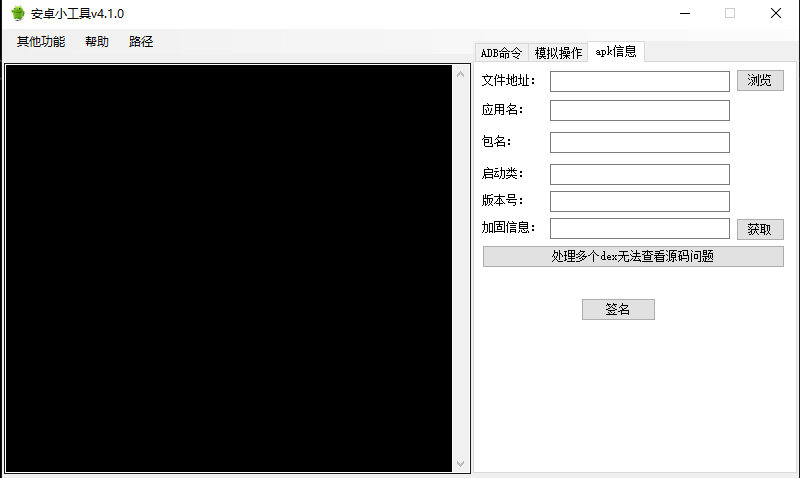

# AndroidTools
该库不在维护了,转移到flutter,可以开发（Windows、Macos、Linux）。见[flutter_mobile_command_tools](https://github.com/LuckyLi706/flutter_mobile_command_tools)

## 基本命令

+ 获取设备（如果有多个手机连接电脑，可以通过获取设备来区分）
  获取包名（获取当前app，卸载app、清除数据、截屏都是基于该app执行的）

+ 无线连接
  默认的用了一些模拟器，可以自定义ip连接（真机请先确保电脑和手机已经连接，并且在同一局域网下）

+ pull和push（某些目录可能会拿不到权限）：

  pull：从手机中拉取些文件到本地
  push：从本地向手机传输某些文件

+ anr/crash：获取anr和crash信息

+ 其他信息获取：
  一些基本信息的获取

## 模拟操作

+ 点击
+ 滑动
+ 后退
+ 待测试补充

## apk信息

+ apk信息查看

+ AndroidKiller多个dex不能定位到源码的问题

+ apk签名

  签名文件在apksigner文件夹下，使用自己的签名，可以通过替换jks以及config文件
